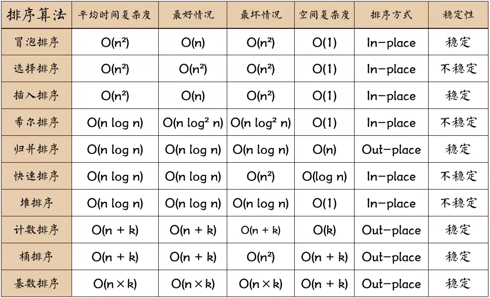

# 备忘随笔
<!--more-->
### 阿里云云大使
[阿里云云大使](https://www.aliyun.com/minisite/goods?userCode=qrowrrh0)
### 骨架屏实现原理
[参考](https://www.cnblogs.com/strick/p/12175534.html)

### Vue开发多页面应用
[参考](https://www.jianshu.com/p/eceb2ac9df90)
[参考](https://segmentfault.com/a/1190000019260231)
[参考](https://www.cnblogs.com/joyZ/p/13434658.html)

### Vue项目SEO优化
[参考资料](https://segmentfault.com/a/1190000019623624)
[参考资料](https://blog.csdn.net/kang_k/article/details/100514042)
[参考资料](https://blog.csdn.net/chjj0904/article/details/79388438)
### Vue history模式打包空白

### Vue 行内样式含变量不生效

### Vue项目中使用图标字体的几种方式
[参考资料](https://www.cnblogs.com/hahahakc/p/13025069.html)

### Vue---组件引入及使用的几种方式
[参考资料](https://www.cnblogs.com/e0yu/p/10795176.html)

### Problems loading reference : Unable to load schema from : Unable to connect......
[参考资料](https://blog.csdn.net/qq_38918953/article/details/106518204)
文件-首选项-设置-应用程序 - proxy Authorization
```json
 "http.proxyAuthorization": "false"
```
>注意: false是字符串
### Vue使用strict模式导致js某些方法不能使用
Exception: TypeError: 'caller', 'callee', and 'arguments' properties may not be accessed on strict mode functions or the arguments objects for calls to them at Function

### js获取函数自身函数名

### Vue 响应式布局
[参考文章](https://www.cnblogs.com/pcysoushu/p/13130359.html)

### Element-ui 导航点击当前页面报错
[参考文章](https://blog.csdn.net/qq_42023279/article/details/107333933)
```js
element-ui.common.js?ccbf:3354 Error: Avoided redundant navigation to current location: "/users".
```
解决方案: router/index.js  中加入如下代码
```js
const originalPush = Router.prototype.push
Router.prototype.push = function push(location) {
  return originalPush.call(this, location).catch(err => err)
}
```

### Element-ui  input密码框  
添加 show-password  用户可切换密码显示或隐藏,默认隐藏
添加 type="password" 则为隐藏状态,不可切换
### Element-ui  tree getCheckedKeys/getHalfCheckedKeys
### Element-ui  ref  属性


### splice 用法
### js数组有哪些方法,哪些能改变原数组,哪些不能?
### el-table  折叠列  宽度设置   width=200/"200px"


### Vue 导航守卫


### Vue 路由及组件懒加载
[参考资料](https://www.cnblogs.com/xiaoxiaoxun/p/11001884.html)


### el-table   ref,prop,data,slot-scope属性


### Vue中prop data method computed 的命名冲突处理策略
[参考资料](https://blog.csdn.net/lyt_angularjs/article/details/105121406?utm_medium=distribute.pc_relevant_t0.none-task-blog-BlogCommendFromMachineLearnPai2-1.channel_param&depth_1-utm_source=distribute.pc_relevant_t0.none-task-blog-BlogCommendFromMachineLearnPai2-1.channel_param)


###  Http常见请求方式有哪些?有什么区别?


### :model和v-model的区别


### Http  Authorization


### element  template  eslint  报错
[参考资料](https://blog.csdn.net/hongkid/article/details/96035394)
安装
```bash
npm install --save-dev eslint-config-elemefe eslint
```
.eslintrc file添加
```json
{
  "extends": "elemefe"
}
```
### ${} es6模板字符串插变量
console.log( ` name  :  ${name} , age : ${age} , gender : ${gender} ` )

### Vue项目配置favicon

### 嵌套路由页面跳转子路由内容不显示

### VSCode快捷键
[参考资料](https://www.cnblogs.com/bindong/p/6045957.html)

### js对象深拷贝的3种方法   已生成
js对象不像变量那样，简单的赋值就能进行克隆的，对象进行赋值时，只是创建了一个新的指针指向相同的存储空间。就像这样
```js
var a={a:1}
var b=a;
b.a=2
console.log(a.a);  // 2
```
这时输出a你会发现，a的值同样发生了改变。
这一点在你进行数据操作时，又想保留原来数据时，你就需要深度克隆了。

1. 方法一:js序列化

有一种时通过js序列化，将js转换成字符串，然后再将字符串转换成js对象。

具体代码为:
```js
var obj = {a:1};
var str = JSON.stringify(obj); //序列化对象
var newobj = JSON.parse(str); //还原
```
2. 方法二:对象遍历逐条复制
就是进行对象的遍历复制，对对象的每一条属性进行复制，这样就能进行对象的深度克隆
```js
function deepCopy(obj) {
  var str, newobj = obj.constructor === Array ? [] : {};//constructor 属性返回对创建此对象的数组函数的引用。创建相同类型的空数据
  if (typeof obj !== 'object') {
    return;
  } else {
    for (var i in obj) {
      if (typeof obj[i] === 'object'){//判断对象的这条属性是否为对象
        newobj[i] = newObj(obj[i]);//若是对象进行嵌套调用
      }else{
        newobj[i] = obj[i];
      }
    }
  }
  return newobj;//返回深度克隆后的对象
};
```
3. 方法三: ES6对象展开赋值
还一种就是应用es6的语法对象展开运算符进行对象的展开赋值；
```js
let a = {a:0}
let b = {...a}
```
>是不是太简单了?!

[参考资料](https://blog.csdn.net/huchangjiang0/article/details/79990068)

### 打包报错:No module factory available for dependency type: CssDependency   已生成
[参考资料](https://blog.csdn.net/weixin_45615791/article/details/104294458)
问题描述：在打包过程出现 没有可用于依赖类型的模块 CssDependency
在vue.config.js中添加就可以解决问题
```js
module.exports = {
  css: {
    extract: false
  }
};
```
 
### Hexo IDE表格预览正常,网页原文输出
表格代码前后均需留最少一个空行
前面不留空行表格会原文输出,后面不留空行后面的文本会追加到表格


### Hexo下表格的美化和优化
[参考文章](https://hexo.imydl.tech/archives/6742.html)

### 简述下列函数的用处
```js
function deal(ob=new Object(),search=''){
  return ob.filter(product=>Object.keys(product).some(key=>String(product[key]).indexOf(search)>-1))
}
```
### 调试下列函数输出正确的值
```js
function a(){
  this.aa='Hello',
  b();
  function b(){
    console.log(a.aa);  // console.log(this.aa)   输出:Hello
  }
}
a();
```
### 如何解决跨域问题?

### 实现对象的深拷贝

### 数组去重?
[参考文章1](https://blog.csdn.net/xing476255461/article/details/100067006)

[参考文章2](https://segmentfault.com/a/1190000016418021)
1. 将数组的每一个元素依次与其他元素做比较，发现重复元素，利用数组方法splice()删除重复元素
```js
   var arr = [1,23,1,1,1,3,23,5,6,7,9,9,8,5,5,5,5];
   function norepeat(arr) {
       for(var i = 0; i < arr.length-1; i++){
           for(var j = i+1; j < arr.length; j++){
               if(arr[i]==arr[j]){
                   arr.splice(j,1); 
                   j--;
               }
           }
       }
       return arr;
   }
   var arr2 = norepeat(arr);
   console.log(arr2);    //[1, 23, 3, 5, 6, 7, 9, 8]

```
2. 使用双层循环改变原数组
```js
   var arr = [1,1,2,2,3,3,4,4,5,5,4,3,1,2,6,6,6,6];
 	console.log(arr); 
   function norepeat(arr){
       for(var i=0;i<arr.length;i++){
           for(var j=0;j<arr.length;j++){
                if(arr[i] == arr[j] && i !=j){
                    arr.splice(j,1);
                }
            }
        }
        return arr;
    }   
    var arr2=norepeat(arr);
    console.log(arr2);  //[1, 2, 3, 4, 5, 6]

```
3. 借助新数组，判断新数组中是否存在该元素如果不存在则将此元素添加到新数组中（原数组长度不变但被按字符串顺序排序）
```js
        var arr = [1,23,1,1,1,3,23,5,6,7,9,9,8,5];
        console.log(arr); 
        function norepeat(arr){
            var temp=[];
            var end;       //临时变量用于对比重复元素
            arr.sort();
            end=arr[0];
            temp.push(arr[0]);
            for(var i=1;i<arr.length;i++){
                if(arr[i] !=end){   //当前元素如果和临时元素不等则将此元素添加到新数组中
                    temp.push(arr[i])
                    end=arr[i]
                }
            }
            return temp;
        }
    var arr2=norepeat(arr);
    console.log(arr2);   //[1, 23, 3, 5, 6, 7, 8, 9]

```
4. 利用ES6 Set去重（ES6中最常用）
```js
function unique (arr) {
  return Array.from(new Set(arr))
}
var arr = [1,1,'true','true',true,true,15,15,false,false, undefined,undefined, null,null, NaN, NaN,'NaN', 0, 0, 'a', 'a',{},{}];
console.log(unique(arr))
 //[1, "true", true, 15, false, undefined, null, NaN, "NaN", 0, "a", {}, {}]
```
>不考虑兼容性，这种去重的方法代码最少。这种方法还无法去掉“{}”空对象，后面的高阶方法会添加去掉重复“{}”的方法。

### md文档写表格
[参考文章](https://www.jianshu.com/p/abaff828100d)


### JS排序(10种方法)
[参考文章1](https://www.jianshu.com/p/a6ef6e0d1227)

[参考文章2](https://www.jianshu.com/p/a6ef6e0d1227)



|  排序算法  |  平均时间复杂度   |   最好情况               |  最坏情况                 | 空间复杂度         | 排序方式    |  稳定性     |
| :---:     |      :---:       |  :---:                  | :---:                    | :---:              | :---:      | :---:      |
| 冒泡排序   | O(n<sup>2</sup>) |     O(n)                |  O(n<sup>2</sup>)        |   O(1)             | In-place   |  稳定      |
| 选择排序   | O(n<sup>2</sup>) |  O(n<sup>2</sup>)       |  O(n<sup>2</sup>)        |   O(1)             | In-place   |  不稳定    |
| 插入排序   | O(n<sup>2</sup>) |          O(n)           |  O(n<sup>2</sup>)        |   O(1)             | In-place   |  不稳定    |
| 希尔排序   | O(n log n)       |  O(n log<sup>2</sup> n) |  O(n log<sup>2</sup> n)  |   O(1)             | In-place   |  不稳定    |
| 归并排序   | O(n log n)       |  O(n log n)             |  O(n log n)              |   O(n)             | Out-place   |  稳定    |
| 快速排序   | O(n log n)       |  O(n log n)             |  O(n<sup>2</sup>)        |   O(log n)         | In-place   |  不稳定    |
| 堆排序     | O(n log n)       |  O(n log n)             |  O(n log n)              |   O(1)             | In-place   |  不稳定    |
| 计数排序   | O(n+k)           |  O(n+k)                 |  O(n+k)                  |   O(k)             | Out-place   |  稳定    |
| 桶排序     | O(n+k)           |  O(n+k)                 |  O(n<sup>2</sup>)        |   O(n+k)           | Out-place   |  稳定    |
| 基数排序   | O(n×k)           |  O(n×k)                 |  O(n×k)                  |   O(n+k)           | Out-place   |  稳定    |

#### 冒泡排序
通过相邻元素的比较和交换，使得每一趟循环都能找到未有序数组的最大值或最小值。

最好：O(n)，只需要冒泡一次数组就有序了。
最坏：O(n²)
平均：O(n²)
##### 单向冒泡
```js
function bubbleSort(nums) {
  for(let i=0, len=nums.length; i<len-1; i++) {
    // 如果一轮比较中没有需要交换的数据，则说明数组已经有序。主要是对[5,1,2,3,4]之类的数组进行优化
    let mark = true;
    for(let j=0; j<len-i-1; j++) {
      if(nums[j] > nums[j+1]) {
        [nums[j], nums[j+1]] = [nums[j+1], nums[j]];
        mark = false;
      }
    }
    if(mark)  return;
  }
}
```


### 元素水平垂直居中的几种方式?
1. 已知块级元素的宽和高，使用绝对定位absolute和外边距实现水平垂直居中。
```html
<div class="box">
    <div class="center-box1">
        <p>第一种方法: 知道长和宽，使用绝对定位+外边距设定水平垂直居中</p>
    </div>
</div>

.box {
    background: #6c94be;
    width: 100%;
    height: 450px;
    position: relative;
}
.center-box1 {
    position: absolute;
    top: 50%;
    left: 50%;
    margin-top: -100px;
    margin-left: -100px;
    width: 200px;
    height: 200px;
    background: #5B83AD;
}
```
2. 使用css3 display:flex（IE存在兼容性问题）
```html
<div class="box">
    <div class="center-box2">
        <p>第二种方法: 使用css3样式属性display:flex设定水平垂直居中</p>
    </div>
</div>

.box {
    background: #6c94be;
    width: 100%;
    height: 450px;
    display: flex;
}
.center-box2 {
    margin: auto;
    width: 200px;
    background: #5B83AD;
}
```
3.使用绝对定位+CSS3 transform（由于transform中translate偏移的百分比都是相对于自身而言的，所以不像方法一种那样必须知道子元素的宽高才行，但是对于IE只有IE9+才支持）
```html
<div class="box">
    <div class="center-box3">
        <p>第三种方法: 使用css3样式属性transform，transform中translate偏移的百分比值是相对于自身大小的</p>
    </div>
</div>

.box {
    background: #6c94be;
    width: 100%;
    height: 450px;
    position: relative;
}

.center-box3 {
    position: absolute;
    top: 50%;
    left: 50%;
    transform: translate(-50%,-50%);
    background: #5B83AD;
    width: 200px;
}
```
4. 已知子元素的宽和高，设置其样式属性position:absolute;top:0;left:0;bottom:0;right:0;margin:auto;
```html
<div class="box">
    <div class="center-box4">
        <p>第四种方法: 已知宽和高，绝对定位+margin:auto;</p>
    </div>
</div>

.box {
    background: #6c94be;
    width: 100%;
    height: 450px;
    position: relative;
}
.center-box4 {
    position: absolute;
    top: 0;
    left: 0;
    bottom: 0;
    right: 0;
    width: 200px;
    height: 200px;
    background: #5B83AD;
    margin: auto;
}
```

### 网页呈现的内在过程?

### 说说你对语义化的理解?

### 请给Array本地对象增加一个原型方法,用于删除数组条目中重复的条目(可能有多个),返回值是一个包含被删除的重复条目的新数组.

### 请给出输出结果
```js
(function(){
  var a=b=5;
})()
console.log(b);
console.log(a);
```

### CSS选择器有哪些?

### CSS哪些属性可以继承?

### CSS优先级算法?

### CSS3新增伪类有哪些?

### 写一个求和的函数sum,达到如下效果?
```js
// Should equal 15
sum(1,2,3,4,5);
// Should equal 0
sum(5,null,-5)
// Should equal 10
sum('1.0',false,1,true,1,'A',1,'B',1,'C',1,'D',1,'E',1,'F',1,'G',1);
// Should equal 0.3,not 0.30000000000000004
sum(0.1,0.2);

function sum(){
  let sum=0;
  for(let i=0;i<arguments.length;i++){
   if(Object.prototype.toString.call(arguments[i])==='[object Number]'||arguments[i]===true){
      let [r1,r2]=[0,0];
      try{
        console.log(sum);
        r1=sum.toString().split('.')[1].length;
      }catch(e){
        r1=0;
      }
      try{
        r2=arguments[i].toString().split('.')[1].length;
      }catch(e){
        r2=0;
      }
      console.log('r1='+r1+"  r2="+r2);
      let r=r1>r2?r1:r2;
      let m=Math.pow(10,r);
      if(arguments[i]===true){
        arguments[i]=1;
      }
      sum=(sum*m+arguments[i]*m)/m;
    }
  }
  console.log(sum);
}

```

### js判断数据类型的方法?
1. typeof

2. toString()
toString() 是 Object 的原型方法，调用该方法，默认返回当前对象的 [[Class]] 。这是一个内部属性，其格式为 [object Xxx] ，其中 Xxx 就是对象的类型。
对于 Object 对象，直接调用 toString()  就能返回 [object Object] 。而对于其他对象，则需要通过 call / apply 来调用才能返回正确的类型信息。
判断类型举例：
```js
Object.prototype.toString.call('') ;   // [object String]
Object.prototype.toString.call(1) ;    // [object Number]
Object.prototype.toString.call(true) ; // [object Boolean]
Object.prototype.toString.call(Symbol()); //[object Symbol]
Object.prototype.toString.call(undefined) ; // [object Undefined]
Object.prototype.toString.call(null) ; // [object Null]
Object.prototype.toString.call(new Function()) ; // [object Function]
Object.prototype.toString.call(new Date()) ; // [object Date]
Object.prototype.toString.call([]) ; // [object Array]
Object.prototype.toString.call(new RegExp()) ; // [object RegExp]
Object.prototype.toString.call(new Error()) ; // [object Error]
Object.prototype.toString.call(document) ; // [object HTMLDocument]
Object.prototype.toString.call(window) ; //[object global] window 是全局对象 global 的引用
```

### 小数加减法精度BUG原因及解决方案?


### SDK和API的区别?


### js深拷贝与浅拷贝


### 作用域链与原型链


### flex属性的使用
justify-content: center;
align-items: center;


### 骨架屏实现原理


### 闭包的原理


### bootstrap栅格布局原理及版本3和4的区别


### 构造函数


### 声明对象的方式


### vuex的作用及使用方式


### 公众号开发


### H5新增标签

### CSS3新增伪类


### 报错 There are multiple modules with names that only differ in casing.
There are multiple modules with names that only differ in casing.
This can lead to unexpected behavior when compiling on a filesystem with other case-semantic.
Use equal casing. Compare these module identifiers:

如果遇到以上报错，请仔细检查/router/index.js中报错的vue组件文件路径的大小写是否正确
import Goods from ‘@/components/onekeyfollow/Goods’

### 报错 Use /* eslint-disable */ to ignore all warnings in a file.
vue-cli3以上的版本如何关闭ESlint?
将lintOnSave属性设置为false，如果没有就自己写个进去。
```js
module.exports = {
  lintOnSave: false
}
```
老版本如何关闭ESlint?找到文件 bulid/webpack.base.config.js 并注释掉对应代码;分三种情况,注释对应代码后重启项目即可
情况一
```js
module:{
  rules:[
    // {
    //   test: /\.(js|vue)$/,
    //   loader: 'eslint-loader',
    //   enforce: 'pre',
    //   include: [resolcr('src'),resolve('test')],
    //   options:{
    //     formatter:require('eslint-friendly-formatter')
    //   }
    // },
  ]
}
```
情况二
```js
const createLintingRule = () => ({
  // test: /\.(js|vue)$/,
  // loader: 'eslint-loader',
  // enforce: 'pre',
  // include: [resolve('src'), resolve('test')],
  // options: {
  //   formatter: require('eslint-friendly-formatter'),
  //   emitWarning: !config.dev.showEslintErrorsInOverlay
  // }
})
```
情况三
```js
module:{
  rules:[
    // (config.dev.useEslint ? [createLintingRule()]:[]),
    {
      test: /\/vue$/,
      loader: 'vue-loader',
      options: vueLoaderConfig
    },
  ]
}

```

###  什么是跨域请求及解决跨域有哪些方案?
跨域请求:协议不一致、域名不一致、端口不一致  满足其一即为跨域请求
跨域时 请求 能不能发送  (可以将请求发送到服务器,服务器也能够接收到请求并返回响应,但是ajax不接受非本域提供的数据,所有数据是用不了的);
解决跨域方案:
- 同域代理
- jsonp
- CORS

### :model和v-model的区别


### 卸载stylus 安装stylus 查看版本stylus
卸载 stylus :

npm uninstall stylus

安装 stylus :

npm install stylus-loader css-loader style-loader --save-dev

npm install stylus

查看 stylus版本：

npm show style-loader version

### 强大的css预编译stylus以及在vue中使用stylus   已发布

引用stylus官网中的一句话：富于表现力、动态的、健壮的 CSS
stylus是一个强大的css预编译语言,stylus支持省略花括号，支持省略分号，代码整洁，支持引入，并且支持语法内函数
官方地址：https://stylus.bootcss.com/
GitHub地址：https://github.com/stylus/stylus/


mixin.styl:

//配置背景图片函数
```stylus
bg-image($url)
  background-image: url($url + "2.png")
  @media (-webkit-min-device-pixel-ratio: 3),(min-device-pixel-ratio: 3)
    background-image: url($url + "3.png")
variable.styl
```

// 颜色定义规范
$color-theme = #ffcd32

//字体定义规范

```font-size-medium = 14px```

content.vue
```stylus
<style scoped lang="stylus" rel="stylesheet/stylus">
  @import "~common/stylus/mixin"
  @import "~common/stylus/variable"
    .recommend-list
      .list-title
        height 300px
        width 100%
        font-size $font-size-medium
        color $color-theme
      .item
        padding 0 20px 20px 20px
        background bg-image('../images/bg.png')
        &.active
          color #fff
</style>
```
使用非常简单
安装stylus，使用npm安装,stylus和stylus-loader，一个都不能少
npm install stylus stylus-loader --save-dev
使用的话分为两种，一种是直接在vue中的style模块中使用，这时在style模块中中规定好就可以了
<style lang="stylus" rel="stylesheet/stylus"></style>
还有一种是作为.styl文件引入
把css内容放在styl文件中，然后在vue的style模块中通过@import引入

content.styl
```stylus
.recommend-list
      .list-title
        height 65px
        line-height 65px
        text-align center
        font-size $font-size-medium
        color $color-theme
      .item
        display flex
        box-sizing border-box
        align-items center
        padding 0 20px 20px 20px
        background bg-image('../images/bg.png')
        &.active
          color #fff
```
content.vue

```vue
<style>
  @import "content.styl"
</style>
```
链接：https://www.jianshu.com/p/8601ccf91225


